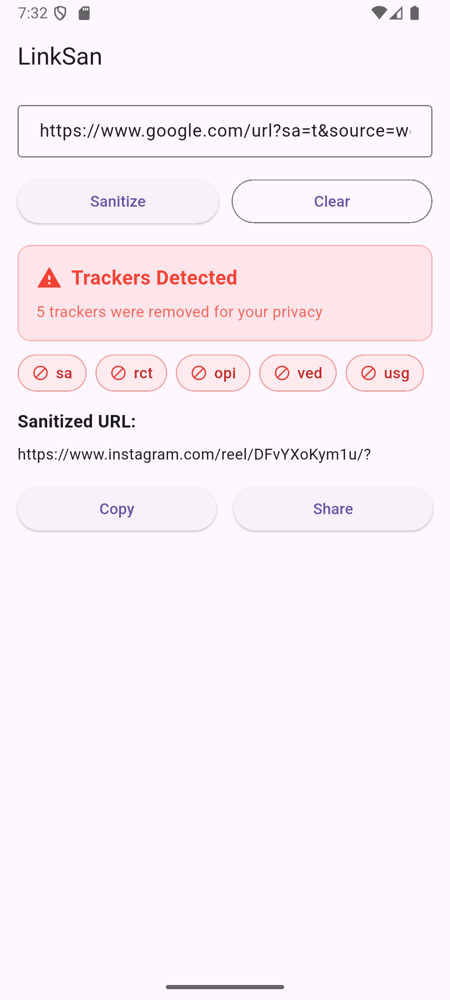
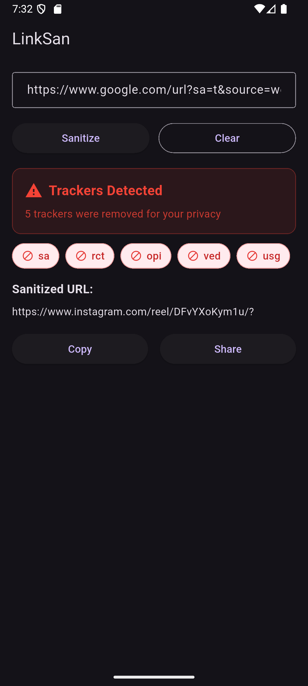
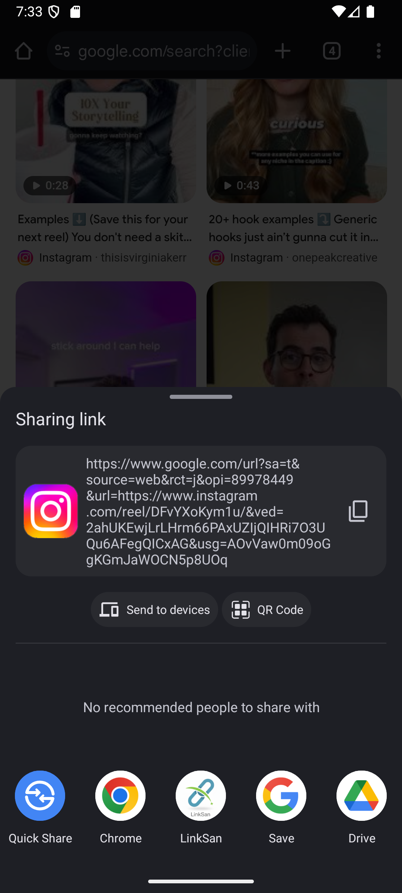
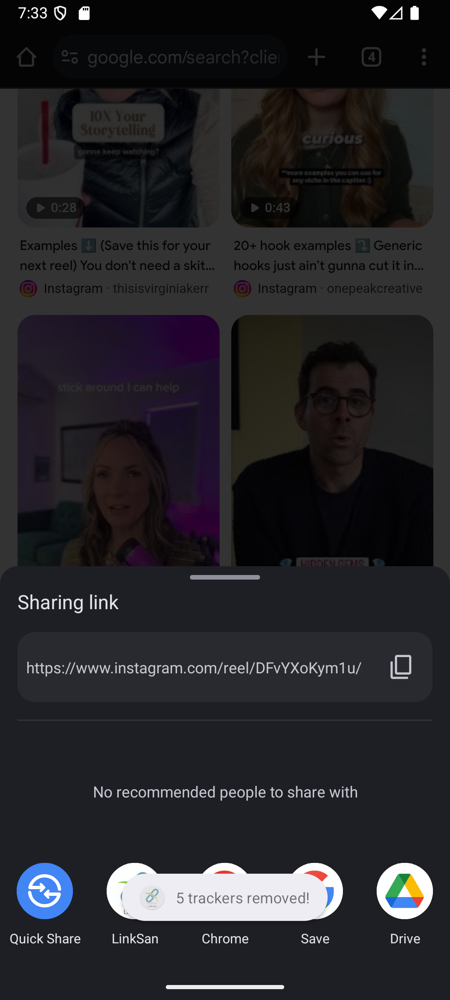

# 🔗 LinkSan

Minimal, open-source app for seamless URL sanitization.


---

## Table of Contents
- [Features](#features)
- [How It Works](#how-it-works)
- [Screenshots](#screenshots)
- [Getting Started](#getting-started)
- [Installation](#installation)
- [Building from Source](#building-from-source)
- [Performance](#performance)
- [Technical Details](#technical-details)
- [Contributing](#contributing)
- [License](#license)

---

## Features

- One-tap URL sanitization
- Removes tracking & marketing parameters
- Share integration from any app
- Light/dark mode support
- Fast, offline, and open source

---

## How It Works

1. Share a URL from any app to LinkSan
2. LinkSan removes tracking parameters
3. Copy or share the clean URL

**Example:**
```
https://example.com/article?utm_source=newsletter&utm_medium=email&fbclid=123
→
https://example.com/article
```

---

## Screenshots

| Light | Dark |
|-------|------|
|  |  |

| Share | Result |
|-------|--------|
|  |  |

---

## Getting Started

1. [Download the APK](https://github.com/ganixdev/linksan/releases)
2. Install on Android (5.0+)
3. Share a URL to LinkSan

---

## Installation

- Android 5.0+ required
- Download APK from [releases](https://github.com/ganixdev/linksan/releases)
- Enable "Install from Unknown Sources"

---

## Building from Source

```bash
git clone https://github.com/ganixdev/linksan.git
cd linksan
flutter pub get
flutter build apk --release
```

---

## Performance

- Processes URLs in <10ms
- Minimal memory and battery use
- Small APK size

---

## Technical Details

- Flutter 3.x, Dart 2.19+
- Material Design 3 UI
- Provider state management
- Key dependencies: share_plus, clipboard, fluttertoast

---

## Contributing

- Report issues or suggest features
- PRs welcome! See `assets/rules.json` for tracking rules

---

## Acknowledgments

- [Brave Browser](https://brave.com/) and [AdGuard](https://adguard.com/) for privacy research
- Flutter & open source community

---

## License

Apache License 2.0 © 2025 LinkSan

---

---

## Support

[](https://ko-fi.com/ganixdev)

If you find LinkSan useful, you can support development by buying me a coffee on Ko-fi!

---

*Made with ❤️ for effortless URL cleaning*
